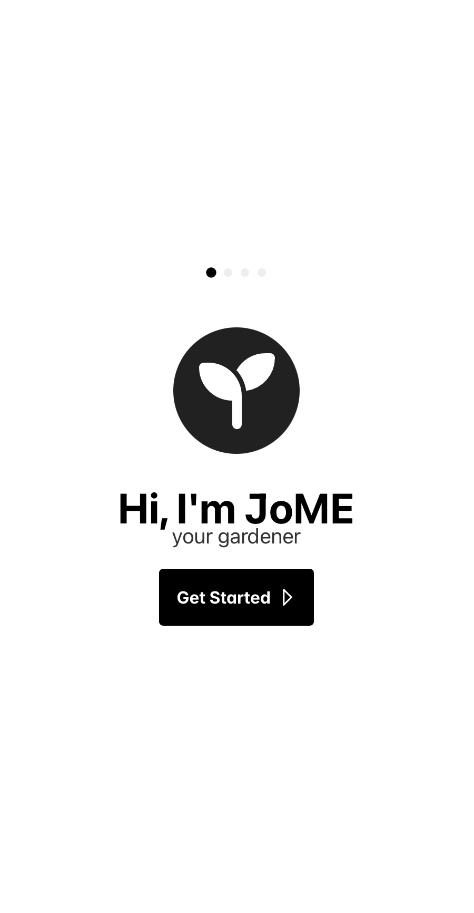

# JoME - Smart Watering System

JoME is an intelligent watering solution designed for urban gardens, home gardens, and greenhouses. This repository contains the mobile application component of the system, built with React, TypeScript, and Vite.

<p align="center">
  
</p>

## Overview

JoME helps you maintain optimal water conditions for your plants through:

- Automated watering schedules
- Real-time monitoring of soil moisture
- Remote control capabilities
- Smart programming interface for the controller board

## Features

- 📱 Mobile-first interface
- 🌱 Real-time plant monitoring
- ⏱️ Customizable watering schedules
- 📊 Water usage analytics
- 🔗 IoT connectivity with the controller board
- 🔄 Automated system adjustments

## Technical Stack

- React 19
- TypeScript
- Vite
- ESLint for code quality
- Mobile-responsive design
- Capacitor JS to build for native IOS/Android platforms

## Development Setup

1. Install dependencies:

```bash
npm install
```

2. Start development server:

```bash
npm start
```

## Build

```bash
npm build
```

- For IOS:

```
npx cap open ios
```

- For Android:

```
npx cap open android
```

## Contributing

Contributions are welcome! Please read [CONTRIBUTING.md](CONTRIBUTING.md) before submitting pull requests.

Architecture, device protocol and roadmap live in [docs/](docs/README.md); the design system and screen mockups in [design/](design/README.md).
